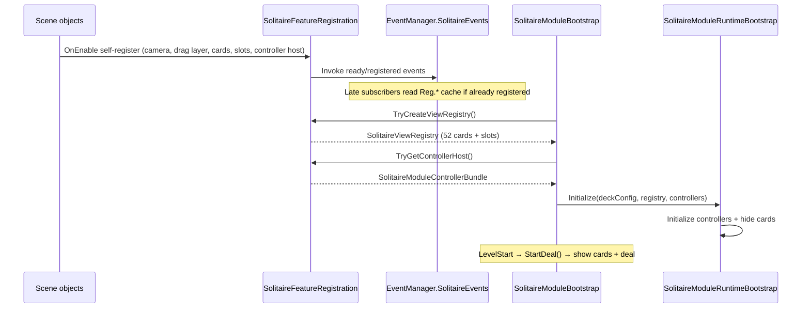

# Solitaire Module Runtime Wiring

This document describes how the Solitaire feature wires scene objects at runtime without a god-object bootstrap or cross-branch serialized references.

The pattern follows project hierarchy rules:

- Scene objects **self-register** when enabled.
- Cross-system discovery uses **`EventManager.SolitaireEvents`** (`UnityAction`, not custom static `Action`).
- **`SolitaireModuleBootstrap`** is the composition root and owns **config only** (`SolitaireDeckConfigSO`).
- **`SolitaireFeatureRegistration`** is the session registry that collects registrations and builds `SolitaireViewRegistry`.
- **`SolitaireModuleControllerHost`** resolves sibling controllers on one GameObject and publishes a controller bundle.

`SolitaireModuleInstaller`, `SolitaireModuleSceneBindings`, and runtime `GetComponentsInChildren` autodiscovery are **removed**. Use this document instead.

For how large Solitaire scripts were split into `*Logic` partials (`CardViewLogic`, `SolitaireHintLogic`, `SolitaireBoardLayoutCalculator`), see [HOW_TO_REFACTOR_WITH_LOGIC_PARTIALS.md](../02_How_To/HOW_TO_REFACTOR_WITH_LOGIC_PARTIALS.md).

For physical script folders (`Bootstrap/`, `Board/`, `Hints/`, `Views/Card/`, etc.), see [SOLITAIRE_MODULE_FOLDER_STRUCTURE.md](./SOLITAIRE_MODULE_FOLDER_STRUCTURE.md).

---

## Prefab hierarchy

```text
SolitaireRoot
├── SolitaireModuleBootstrap          (only serialized field: deckConfig)
├── SolitaireBoardCamera              (Camera + AudioListener + SolitaireBoardCameraController)
├── DeckParent
│   └── Card_00 … Card_51             (CardView + baked CardId)
├── DragParent                        (SolitaireDragLayer)
├── SlotRoot
│   └── … slot anchors                (SolitaireSlotAnchor)
└── Controllers
    └── ControllerHost                (all gameplay controllers + SolitaireModuleControllerHost)
```

Editor setup is handled by `SolitaireSceneBuilder` and the `SolitaireRoot` prefab. The builder wires `deckConfig` on bootstrap and ensures required components exist. It does **not** bake cross-GO controller references into bootstrap.

---

## Startup sequence



### Registration sources

| GameObject | Component | When | Registry / event |
|------------|-----------|------|------------------|
| `SolitaireBoardCamera` | `SolitaireBoardCameraController` | `OnEnable` | `BoardCamera` + `BoardCameraReady` |
| `DragParent` | `SolitaireDragLayer` | `OnEnable` | `DragLayer` + `DragLayerReady` |
| Each `Card_XX` | `CardView` | `OnEnable` (if `CardId >= 0`) | `RegisteredCards[id]` + `CardRegistered` |
| Each slot | `SolitaireSlotAnchor` | `OnEnable` | slot list + `SlotRegistered` |
| `ControllerHost` | `SolitaireModuleControllerHost` | `OnEnable` | `ControllerHost` + `ControllerHostReady` |

### Unregistration policy

| Object | Unregister on |
|--------|----------------|
| Cards, slots | `OnDestroy` |
| Controller host | `OnDisable` |
| Board camera, drag layer | `OnDisable` |

Cards and slots unregister on **`OnDestroy`**, not `OnDisable`, so toggling visibility does not drop registration. Slots stay active during pre-deal hide; only **cards** are deactivated before the first deal.

Controller host unregisters on **`OnDisable`** because disabled controllers must not remain callable through a stale runtime bundle.

---

## Composition root: `SolitaireModuleBootstrap`

Inspector:

- **Only** `deckConfig` (`SolitaireDeckConfigSO`).

`Start()` (not `Awake`):

1. `SolitaireFeatureRegistration.TryCreateViewRegistry()` — requires camera, drag layer, all 52 cards, valid slots.
2. `SolitaireFeatureRegistration.TryGetControllerHost()` — requires `SolitaireModuleControllerHost` on `ControllerHost`.
3. `deckConfig.Validate()`.
4. `SolitaireModuleRuntimeBootstrap.Initialize(this)` — wires controllers, hides cards.

Deal start:

- `SolitaireLevelStartBridge` listens to `EventManager.InGameEvents.LevelStart` and calls `bootstrap.StartDeal()`.
- `StartDeal()` shows cards and runs `DeckController.StartNewDeal()` (or debug scenario).

Validation (editor button on bootstrap):

- Same checks as runtime `Start()`, without entering play mode graph repair.

---

## Controller host bundle

`SolitaireModuleControllerHost` lives on `ControllerHost` with all gameplay controllers as **sibling components on the same GameObject**.

On `OnEnable`:

```csharp
SolitaireModuleControllerBundle bundle = SolitaireModuleControllerBundle.FromHost(gameObject);
SolitaireFeatureRegistration.RegisterControllerHost(bundle);
EventManager.SolitaireEvents.ControllerHostReady?.Invoke(bundle);
```

On `OnDisable`, the host unregisters the same bundle. This prevents `SolitaireFeatureRegistration.ControllerHost` from pointing at disabled controller components.

`FromHost` performs **8× `GetComponent` on the same GameObject only** (not children, not parent). The bundle is an **instance** stored in `SolitaireFeatureRegistration.ControllerHost`; it is not a static singleton of controllers.

Required on `ControllerHost`:

- `SolitaireDeckController`
- `SolitaireInputController`
- `SolitaireLayoutController`
- `SolitairePointerInputSource`
- `SolitaireHapticFeedbackProvider`
- `SolitaireLevelStartBridge`
- `SolitaireWinBridge`
- `SolitaireDebugScenarioRunner` (optional; may be null)

Bootstrap never holds serialized references to these controllers.

---

## Event bus: `EventManager.SolitaireEvents`

Defined in `EventManager.Solitaire.cs` (partial `EventManager`).

| Event | Payload | Typical subscribers |
|-------|---------|---------------------|
| `BoardCameraReady` | `SolitaireBoardCameraController` | `SolitairePointerInputSource`, `SolitaireLayoutController` |
| `BoardViewportSizeChanged` | none | `SolitaireLayoutController` |
| `DragLayerReady` | `Transform` | `SolitaireInputController` |
| `CardRegistered` | `CardView` | optional tooling / future listeners |
| `SlotRegistered` | `SolitaireSlotAnchor` | `SolitaireDebugGizmos` |
| `ControllerHostReady` | `SolitaireModuleControllerBundle` | optional external listeners |

Subscribers that enable **after** registration should also read the cached value from `SolitaireFeatureRegistration` (see `HandleBoardCameraReady` / `HandleDragLayerReady` pattern).

`SolitaireBoardCameraController` is the **single board camera authority**. It monitors viewport changes and raises `BoardViewportSizeChanged` via `SolitaireFeatureRegistration.NotifyBoardViewportSizeChanged()`.

`EventManager.SolitaireEvents.Reset()` owns the event-field cleanup. `SolitaireFeatureRegistration.Reset()` clears registry state and then delegates event cleanup to that EventManager method.

---

## `SolitaireFeatureRegistration` responsibilities

Static session registry (reset on `SubsystemRegistration` for domain reload):

- Holds `BoardCamera`, `DragLayer`, `ControllerHost`, fixed card array (52), slot list.
- Publishes registration events through `EventManager.SolitaireEvents`.
- `TryCreateViewRegistry()` validates completeness and produces immutable `SolitaireViewRegistry` for runtime bootstrap.
- Fails fast on duplicate board camera, drag layer, controller host, card id, or slot pile registration.
- `GetRegisteredSlotsSnapshot()` returns a copied snapshot; callers must not mutate registry-owned lists.

No scene search. No `Find`. No child traversal.

### Duplicate registration policy

| Registration | Duplicate behavior |
|--------------|--------------------|
| Board camera | Different camera throws immediately |
| Drag layer | Different layer throws immediately |
| Controller host | Different bundle throws immediately |
| Card | Same `CardId` on a different `CardView` throws immediately |
| Slot | Same `PileType` + `PileIndex` on a different slot throws immediately |

This is intentional. Silent overwrite makes scene defects hard to diagnose; duplicate registration should fail before a board state is created.

---

## Runtime lookup policy

**Forbidden at runtime**

- `GetComponentInParent` / `GetComponentsInChildren` for wiring
- `GameObject.Find` / cross-branch `Transform.Find`

**Allowed at runtime**

- `GetComponent` on **same GameObject** (controller host bundle, camera on self)
- `GetComponent` on an object already obtained (raycast / hit test)
- Editor-only discovery in `SolitaireSceneBuilder`

**Gray area (prefer bake later)**

- `CardView` may `transform.Find("DragShadow")` on its own child; prefer serialized child reference when touching that code.

---

## Move handler registry

`SolitaireMoveHandlerRegistry` is a rules-side dispatch table for move validation and execution.

- Public mutation still goes through `SolitaireMoveExecutor.TryExecute(...)`.
- Handler array size is derived from the current `SolitaireMoveType` enum values.
- Unsupported or out-of-range move types are rejected before indexing into handler arrays.
- The registry must stay internal to rules/runtime code; do not call it from input, UI, or scene components.

---

## Editor responsibilities

`SolitaireSceneBuilder` (editor only):

- Creates or repairs `SolitaireRoot` hierarchy.
- Ensures 52 cards under `DeckParent`, slots under `SlotRoot`, `SolitaireDragLayer` on `DragParent`.
- Adds `SolitaireModuleControllerHost` and controller components on `ControllerHost`.
- `WireBootstrap` assigns **only** `deckConfig`.
- Uses `Find` / `GetComponentInChildren` for repair — not copied to runtime.

`SolitaireModuleBootstrapEditor` exposes Validate; it does not inject scene references into bootstrap.

---

## Validation checklist

Before play mode or build:

- [ ] `SolitaireRoot` has `SolitaireModuleBootstrap` with valid `deckConfig`.
- [ ] `SolitaireBoardCamera` has `SolitaireBoardCameraController` + `Camera`.
- [ ] `DragParent` has `SolitaireDragLayer`.
- [ ] `DeckParent` has exactly 52 children with valid `CardView` / `CardId`.
- [ ] All `SolitaireSlotAnchor` instances are under `SlotRoot` and configured.
- [ ] `ControllerHost` has `SolitaireModuleControllerHost` and all required controller components.
- [ ] Template scene uses one active gameplay camera policy (template `Main Camera` deactivated when Solitaire camera is used).
- [ ] Bootstrap **Validate** passes in inspector.

---

## Common pitfalls

1. **Missing `.meta` GUID** — manually created script `.meta` files must be exactly 32 hex characters or Unity ignores the script (`EventManager.SolitaireEvents` will not compile).
2. **Hiding slots before deal** — deactivating slot GameObjects breaks hit tests and card coroutines; hide cards only (`SetBoardVisible`).
3. **Unregister on `OnDisable` for cards/slots** — causes empty registry after visibility toggles; use `OnDestroy`.
4. **Dragging controller refs into bootstrap** — breaks SRP; controllers belong on `ControllerHost` only.
5. **Second camera** — board systems must subscribe to `BoardCameraReady`, not serialize a scene camera from another branch.
6. **Duplicate card ids or duplicate slot pile refs** — registration throws by design; fix the prefab/scene identity instead of catching the exception.
7. **Mutating registration snapshots** — snapshots are read-only copies for tooling/debug display, not a runtime mutation path.

---

## Related files

| Role | Path |
|------|------|
| Composition root | `Assets/_Game/Scripts/Project/SolitaireModule/Bootstrap/SolitaireModuleBootstrap.cs` |
| Registration hub | `Assets/_Game/Scripts/Project/SolitaireModule/Bootstrap/SolitaireFeatureRegistration.cs` |
| Controller bundle | `Assets/_Game/Scripts/Project/SolitaireModule/Bootstrap/SolitaireModuleControllerBundle.cs` |
| Controller host | `Assets/_Game/Scripts/Project/SolitaireModule/Bootstrap/SolitaireModuleControllerHost.cs` |
| Runtime init | `Assets/_Game/Scripts/Project/SolitaireModule/Bootstrap/SolitaireModuleRuntimeBootstrap.cs` |
| Solitaire events | `Assets/_Game/Scripts/Managers/Core/EventManagers/EventManager.Solitaire.cs` |
| Scene builder | `Assets/_Game/Scripts/Project/SolitaireModule/Editor/SolitaireSceneBuilder.cs` |
| Prefab | `Assets/_Game/Prefabs/_InGame/Solitaire/SolitaireRoot.prefab` |
| Baked wiring context | `Docs/01_Permanent_Project_Rules/BAKED_WIRING_FUTURE_RULES.md` |
| General hierarchy rules | `Docs/99_Source_Baseline/HierarchyWiringRules.md` |
