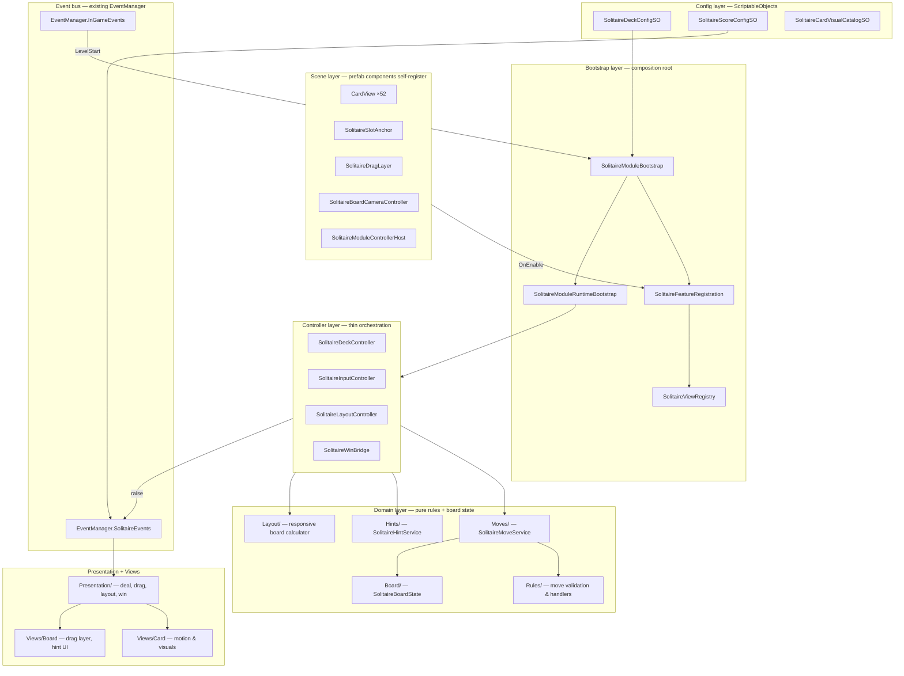
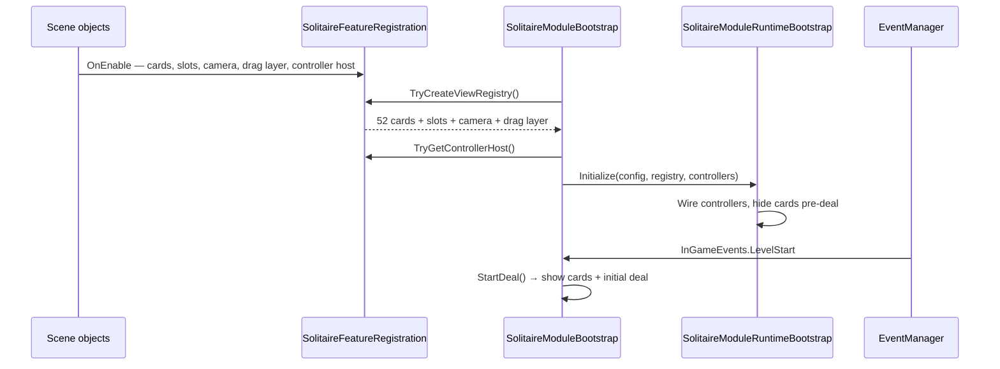
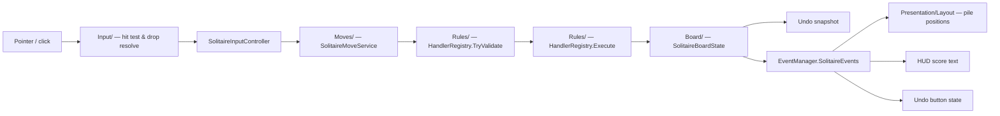

# Klondike Solitaire BaseProject

A classic Klondike Solitaire module built inside the Handler Unity BaseProject template. This is not a greenfield Unity sample: the game is composed through the existing LEGO-style, component-driven, inspector-driven, event-based project architecture.

The implementation follows the reference shape from [XeldarAlz/KlondikeSolitaire](https://github.com/XeldarAlz/KlondikeSolitaire) while staying native to this project: no new global managers, no duplicate event bus, no replacement input stack, and no scene rebuild.

> Current quality gate: **20 automated tests** across EditMode and PlayMode, plus repeatable editor benchmark tooling and scene/prefab validation tooling.

## About

This repository is a playable Solitaire-focused BaseProject variant and a template example for composing a full card game with the project architecture:

- **Clean Klondike rules** - draw-1 stock, waste, 7 tableau columns, 4 foundations, alternating-color tableau builds, same-suit ascending foundations.
- **Scene-first module wiring** - cards, slots, board camera, drag layer, and controllers self-register through the existing Solitaire event channel.
- **Undo-ready runtime state** - move history stores board snapshots and restores pile/card face state.
- **Score display** - score is event-driven through `EventManager.SolitaireEvents` and configured by `SolitaireScoreConfigSO`.
- **Hint support** - legal move hints are collected through the existing rules/move services and shown through a focused presenter.
- **AutoComplete support** - deterministic foundation moves execute through the existing move path, preserving score and undo behavior.
- **Responsive portrait board and HUD** - board layout is recalculated from runtime state and the HUD switches between a two-row portrait layout and a right-side landscape stack.
- **Debug scenarios** - editor/play-mode scenario tooling exists for targeted QA setups.
- **No menu/ad layer in the module** - Solitaire reports success through the base project flow instead of owning global UI.

## Performance Budget

| Metric | Budget / Current Contract |
| --- | --- |
| Runtime card instances | 52 authored/reused card views |
| Normal restart allocation | No runtime card Instantiate/Destroy path |
| Card lookup | Fixed 52-slot registry |
| Layout recalculation | Bounded by 52 cards |
| Move validation | Rules-side validation with no scene search |
| Draw calls | Keep card sprites atlas/batching friendly |

### Local Benchmarks

Latest measured run:

- Unity `6000.3.16f1`
- Platform `OSXEditor`
- Device `Apple M3 / Apple M3`
- Runner: `Tools/Solitaire/Run Benchmarks`

| Benchmark | Iterations | Total | Average | Throughput |
| --- | ---: | ---: | ---: | ---: |
| Initial deal | 20,000 | 129.230 ms | 6.461 us | 154,763 ops/s |
| Tableau move validation | 250,000 | 26.371 ms | 0.105 us | 9,480,290 ops/s |
| Stock draw plus undo | 20,000 | 104.574 ms | 5.229 us | 191,253 ops/s |
| Snapshot create plus restore | 20,000 | 80.017 ms | 4.001 us | 249,948 ops/s |
| Score event dispatch plus update | 500,000 | 3.463 ms | 0.007 us | 144,366,807 ops/s |
| Hint enumeration | 100,000 | 268.426 ms | 2.684 us | 372,542 ops/s |
| AutoComplete foundation sweep | 20,000 | 818.944 ms | 40.947 us | 24,422 ops/s |

Runtime rendering snapshot from the current editor session is reported using the same comparison-friendly counter family as the reference project: Unity Editor Play Mode plus Frame Debugger. After the board settled, Frame Debugger grouped the frame into `8` URP render events; the Solitaire card/slot sprites rendered under one `DrawTransparentObjects/RenderLoop.DrawSRPBatcher` event, followed by final blit and screen-space UI events. Unity FrameTiming reported CPU main-thread frame time at about `0.9 ms` in the editor (`0.74-1.28 ms` observed range). Scripts and Rendering profiler sub-timings are intentionally omitted here because their source/capture mode is not documented in the reference project.

Sprite atlas validation is enabled for editor and WebGL captures: `SolitaireSprites.spriteatlas` is packed as a single `8192x4096` WebGL atlas page for visible Solitaire sprites, with `35/36` active SpriteRenderers using packed sprites in the measured frame. The remaining unpacked SpriteRenderer is the transient deck ripple effect.

HUD layout was revised after Hint/AutoComplete were added: 390x844 portrait and 844x390 landscape bounding-box checks for Moves, Score, Undo, Hint, and AutoComplete returned no overlaps. Real gameplay screenshots are still kept as a deployment validation step rather than claimed here.

### Rendering Optimizations

- **Pre-authored card views** - the board reuses existing card objects instead of spawning during normal play.
- **Fixed registry** - `SolitaireViewRegistry` maps card ids directly to `CardView` instances.
- **Responsive sizing** - `SolitaireLayoutController` scales slots/cards from config and board camera metrics.
- **Layered drag presentation** - dragged cards move under `DragParent` and render above board cards.
- **Config-driven visuals** - `SolitaireCardVisualCatalogSO` owns card sprite lookup instead of hardcoded runtime choices.
- **Runtime visibility culling** - overlapped stock/foundation cards, inactive drag shadows, inactive selection highlights, and covered slot ghosts do not keep their SpriteRenderers enabled.
- **Atlas-first SpriteRenderer path** - the module stays on SpriteRenderer rendering, with `SolitaireSprites.spriteatlas` set to editor/WebGL packing instead of moving cards to Canvas or a custom mesh renderer.

## Architecture

This project is a **LEGO-style Unity template**: gameplay is composed from existing prefabs, inspector references, small MonoBehaviours, ScriptableObject config, and centralized events — not from new global managers or scene-wide searches.

### Layer model



**Read the diagram top-down:** config tunes the module, scene objects register themselves, bootstrap builds the session registry, controllers orchestrate, domain services own rules/state, presentation reacts through events.

### Startup flow



### Player move flow



### Code folders (Solitaire module)

Physical folders are split by **domain**, not by a single `Runtime/` dump. Namespaces stay stable (`Runtime`, `Controllers`, `Views`, …) so prefab script GUIDs keep working.

```text
SolitaireModule/
├── Data/              Config assets + shared types
├── Rules/             Pure validation, move handlers, resolver
├── Input/             Pointer, hit test, drop targets
├── Bootstrap/         Module start, registration, controller bundle
├── Board/             Board state, piles, snapshots
├── Moves/             Move service, executor, undo path
├── Hints/             Hint + autocomplete logic
├── Layout/            Responsive board layout math
├── Registry/          View registry + runtime context
├── Debug/             Debug scenario tooling
├── Controllers/       Deck, input, layout, win bridges (thin)
├── Presentation/      Deal / Layout / Drag / Win presenters
├── Views/             Card / Slots / Board / Fx view components
└── Editor/            Scene builder, benchmarks, validation
```

### Architecture rules (short)

- Uses the existing `EventManager.SolitaireEvents` partial — **no new event bus**.
- `SolitaireModuleBootstrap` is the composition root and owns **config only** (`deckConfig`).
- `SolitaireFeatureRegistration` is the session registry for self-registered scene objects.
- `SolitaireMoveResolver` + `SolitaireMoveHandlerRegistry` validate; `SolitaireMoveExecutor` mutates board state.
- Large scripts split into `*Logic` **partial** files (`CardViewLogic`, `SolitaireHintLogic`, `SolitairePileMoveRules`, …).
- Internal static helpers hold pure rules; MonoBehaviours hold Unity lifecycle and inspector refs.
- No `FindObjectOfType` / scene search on production paths; no replacement manager architecture.

Further reading: [SOLITAIRE_MODULE_RUNTIME_WIRING.md](Docs/03_Hierarchy/SOLITAIRE_MODULE_RUNTIME_WIRING.md), [SOLITAIRE_MODULE_FOLDER_STRUCTURE.md](Docs/03_Hierarchy/SOLITAIRE_MODULE_FOLDER_STRUCTURE.md), [HOW_TO_REFACTOR_WITH_LOGIC_PARTIALS.md](Docs/02_How_To/HOW_TO_REFACTOR_WITH_LOGIC_PARTIALS.md).

## Tech Stack

Unity 6, URP, Unity UI, DOTween, NiceVibrations, Unity Test Framework, MCP for Unity, BaseProject `EventManager`, ScriptableObject config assets.

## Testing

20 tests are provided under `Assets/_Game/Tests/SolitaireModule`:

- **EditMode (16):** initial deal, 52-card uniqueness, tableau legality, foundation legality, waste top-card rule, stock draw, waste recycle, undo, invalid no-mutation guard, win detection, score config/event guards, hint ordering/cycling, autocomplete move path, module layer/serialization guards.
- **PlayMode (4):** controller host self-registration, drag layer registration, board camera registration/screen conversion, duplicate slot fail-fast behavior.

Recommended local commands:

```bash
/Users/bengisucay/Unity/Hub/Editor/6000.3.16f1/Unity.app/Contents/MacOS/Unity \
  -projectPath /Users/bengisucay/Unity/BaseProject -batchmode -nographics \
  -executeMethod _Game.Scripts.Project.SolitaireModule.Editor.SolitaireTestRunnerUtility.RunEditModeAndExit \
  -logFile /tmp/baseproject-test-results/api-editmode.log

/Users/bengisucay/Unity/Hub/Editor/6000.3.16f1/Unity.app/Contents/MacOS/Unity \
  -projectPath /Users/bengisucay/Unity/BaseProject -batchmode -nographics \
  -executeMethod _Game.Scripts.Project.SolitaireModule.Editor.SolitaireTestRunnerUtility.RunPlayModeAndExit \
  -logFile /tmp/baseproject-test-results/api-playmode.log
```

Latest local evidence: EditMode `16/16` passed in `/tmp/baseproject-test-results/api-editmode.xml`; PlayMode `4/4` passed in `/tmp/baseproject-test-results/api-playmode.xml`.

Editor validation is also available through:

- `Tools/Solitaire/Validate Main Scene`
- `Tools/Solitaire/Repair Main Scene`
- `Tools/Solitaire/Run Benchmarks`
- `SolitaireModuleBootstrap.Validate`

## WebGL Publish

Every successful Unity WebGL build is auto-published by `SolitaireWebGLPostBuildPublisher`.

The post-build hook runs the Vercel host script and performs the full publish flow:

- Copies the generated Unity WebGL output into `WebGLHost/game`.
- Patches Unity's generated shell so the canvas fills the wrapper responsively.
- Keeps the wrapper scroll-free in portrait and landscape by letting the host control the iframe size.
- Adds a build-version query string to Unity loader/data/wasm assets so stale browser caches do not show an older build.
- Runs `vercel --prod --yes`.

Manual publish is still available when reusing an existing `webglbuild/` folder:

```bash
cd /Users/bengisucay/Unity/BaseProject/WebGLHost
npm run postbuild:publish
```

To publish a custom Unity output folder:

```bash
cd /Users/bengisucay/Unity/BaseProject/WebGLHost
npm run postbuild:publish -- --source Builds/WebGL/Solitaire
```

For a dry local publish without deploying:

```bash
cd /Users/bengisucay/Unity/BaseProject/WebGLHost
npm run postbuild:local
```

Disable the automatic Unity post-build deploy when needed:

```bash
export SOLITAIRE_WEBGL_AUTO_PUBLISH=0
```

Set `BUILD_VERSION` when a human-readable release tag is useful:

```bash
BUILD_VERSION=cardback-20260609 npm run postbuild:publish
```

## How to Play

- Drag or click a card to move it.
- Build tableau columns downward in alternating colors.
- Build foundations upward by suit, Ace to King.
- Tap stock to draw one card to waste.
- Tap empty stock to recycle waste when recycle is enabled.
- Use Undo to restore the previous move state.
- Use Hint to cycle through currently legal move suggestions.
- Use AutoComplete when safe foundation moves are available.
- Win by placing all 52 cards onto the foundations.

## Documentation

| Document | Description |
| --- | --- |
| [Docs/SolitaireKlondike_GDD.md](Docs/SolitaireKlondike_GDD.md) | Game design, rules, acceptance criteria, QA scenarios |
| [Docs/03_Hierarchy/SOLITAIRE_MODULE_RUNTIME_WIRING.md](Docs/03_Hierarchy/SOLITAIRE_MODULE_RUNTIME_WIRING.md) | Runtime registration and scene wiring contract |
| [Docs/03_Hierarchy/SOLITAIRE_MODULE_FOLDER_STRUCTURE.md](Docs/03_Hierarchy/SOLITAIRE_MODULE_FOLDER_STRUCTURE.md) | Solitaire script folder ownership map |
| [Docs/02_How_To/HOW_TO_REFACTOR_WITH_LOGIC_PARTIALS.md](Docs/02_How_To/HOW_TO_REFACTOR_WITH_LOGIC_PARTIALS.md) | `*Logic` partial refactor pattern |
| [Docs/README_TR.md](Docs/README_TR.md) | BaseProject architecture migration overview |
| [Docs/04_Validation/VALIDATION_CHECKLIST.md](Docs/04_Validation/VALIDATION_CHECKLIST.md) | Project validation checklist |

## About the Workflow

This module is assembled to match BaseProject rules first: existing components, inspector references, ScriptableObject config, runtime context, EventManager events, and focused adapter components. Frameworks from the external reference are mapped to the local architecture instead of imported as parallel systems.
